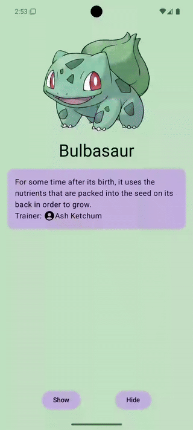

# 🎉 AnimationSequence

[](https://jitpack.io/#pauloaapereira/AnimatedSequence)

**AnimationSequence** is a powerful yet intuitive Jetpack Compose library designed to simplify sequential animations in your Android apps. Easily orchestrate elegant, responsive, and hierarchical animations with minimal effort, enhancing user experience and bringing your UI to life.

<p align="center">
  
</p>

---

## ✨ Why Use AnimationSequence?

- ✅ **Simple & Intuitive**: Effortlessly animate elements sequentially.
- ✅ **Highly Customizable**: Full control over individual animations, delays, and transitions.
- ✅ **Hierarchical Animations**: Seamlessly manage nested animations.
- ✅ **Robust**: Efficient resource cleanup and error handling built-in.

---

## 🚀 Quick Start

Here's a simple example to get you started:

```kotlin
AnimationSequenceHost {
    AnimatedItem(index = 0) {
        Text("Hello, Compose Animations!")
    }
    AnimatedItem(index = 1) {
        Button(onClick = {}) { Text("Animated Button") }
    }
}
```

## 📖 Detailed Usage

### 📌 AnimationSequenceHost

The `AnimationSequenceHost` composable is the core of this library, managing the sequential animation flow.

**Parameters:**

- `modifier: Modifier` *(optional)* - Modifier to be applied to the host container.
- `startByDefault: Boolean` *(optional, default: `true`)* - Automatically starts animations upon composition if set to `true`.
- `content: @Composable (scope: SequentialAnimationScope) -> Unit` - The composable content, providing access to the `SequentialAnimationScope` for granular animation control.

### SequentialAnimationScope

Provides detailed control over animations:

- `enter()` - Animates all items sequentially.
- `exit(all: Boolean = false)` - Animates exit transitions sequentially. When `all` is `true`, exits all animations simultaneously.
- `enter(index: Int)` - Starts the enter animation for a specific indexed item.
- `exit(index: Int)` - Starts the exit animation for a specific indexed item.

### 🖌️ AnimatedItem

Defines individual animated components within the `AnimationSequenceHost`.

**Parameters:**

- `modifier: Modifier` *(optional)* - Modifier applied to the animated content.
- `index: Int` - Unique identifier defining the animation order.
- `delayAfterAnimation: Long` *(optional, default: `400ms`)* - Delay before the next animation starts.
- `enter: EnterTransition` *(optional, default: `fadeIn` with 300ms duration)* - Defines the animation when entering.
- `exit: ExitTransition` *(optional, default: `fadeOut` with 300ms duration)* - Defines the animation when exiting.
- `content: @Composable () -> Unit` - The content to be animated.

## 🎯 Advanced Example

Use `SequentialAnimationScope` for detailed control:

```kotlin
AnimationSequenceHost(startByDefault = false) { scope ->
    LaunchedEffect(Unit) {
        scope.enter()        // Start all animations sequentially
        scope.exit(1)        // Exit animation of item at index 1
        scope.enter(2)       // Enter animation of item at index 2
    }

    AnimatedItem(index = 0) {
        Text("First Animated Item")
    }
    AnimatedItem(index = 1) {
        Text("Second Animated Item")
    }
    AnimatedItem(index = 2) {
        Text("Third Animated Item")
    }
}
```

## 🌳 Hierarchical Animations

Effortlessly manage nested animations:

```kotlin
AnimationSequenceHost {
    AnimatedItem(index = 0) {
        Text("Parent Animated Text")
    }

    AnimationSequenceHost {
        AnimatedItem(index = 0) {
            Text("Child Animated Text 1")
        }
        AnimatedItem(index = 1) {
            Text("Child Animated Text 2")
        }
    }
}
```

When the parent exits, all children automatically perform their exit animations sequentially.

## ⚙️ Installation

**Step 1. Add the JitPack repository to your build file**

In your `settings.gradle.kts` (or `settings.gradle`) file, add:

```kotlin
dependencyResolutionManagement {
    repositoriesMode.set(RepositoriesMode.FAIL_ON_PROJECT_REPOS)
    repositories {
        mavenCentral()
        maven { url = uri("https://jitpack.io") }
    }
}
```

**Step 2. Add the dependency in your build.gradle.kts file**
```kotlin
dependencies {
    implementation("com.github.pauloaapereira:animatedsequence:<version>")
}
```
Replace `<version>` with the latest release version. [](https://jitpack.io/#pauloaapereira/AnimatedSequence)

## 📌 Contribution

Contributions, issues, and feature requests are welcome! Feel free to check the [issues page](https://github.com/pauloaapereira/AnimatedSequence/issues).

## 📄 License

Distributed under the Apache License 2.0.
<a href="https://opensource.org/licenses/Apache-2.0"></a>

## Find this repository useful? :]

Feel free to support me and my new content on: 

<a href="https://www.buymeacoffee.com/ppereira"></a> 

<a href="https://www.paypal.com/donate?hosted_button_id=68Q9V7ZGGAW2W"></a> 

---

Happy Animating! ✨🚀
